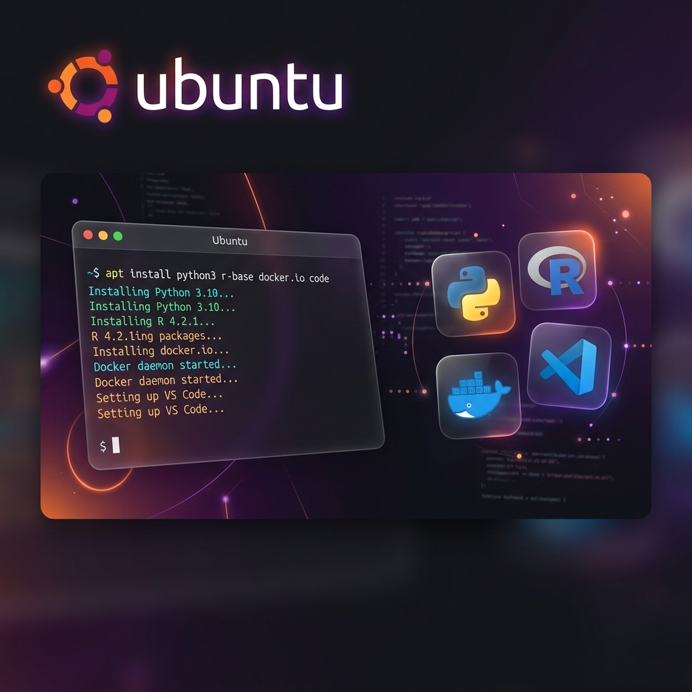

# 🚀 Arch Linux Fresh Install



A modular and interactive Bash utility designed to automate the post-installation setup for Arch Linux systems. This script provides a streamlined, menu-driven interface using `whiptail` to easily select, configure, and install your essential software stack using `pacman` and `yay`.

---

## ⚡ Quick Start

Get your system up and running with a single command:

```bash
curl -sL https://raw.githubusercontent.com/msperlin/arch-fresh-install/main/installer.sh | bash
```

> [!NOTE]
> This command will clone the repository to your `~/Downloads` folder and launch the interactive setup menu.

---

## ✨ Features & Modules

The interactive menu allows you to selectively execute the following tasks:

### 🛠️ Core System
- **System Update:** Full system upgrade using `pacman` and `yay`.
- **System Cleanup:** Automated cache and orphan package cleanup to keep your system lean.

### 📦 Essential Packages
- **Package Selection:** Installs basic software defined in `arch-packages.txt` via `yay`.
- **AUR Integration:** Uses `yay` to seamlessly install and manage third-party software (Chrome, VS Code, etc.) from the Arch User Repository (AUR).
- **Modern Utils:** Installs modern CLI tools like `gh` (GitHub CLI) and `topgrade`.

### 📊 Data Science & Development
- **R Environment:** Installs **R Base** and the latest stable **RStudio Desktop** directly from the AUR.
- **Python Suite:** Sets up a robust Python environment using `pyenv` and `uv` along with essential tools like `python-pip` and `python-pytest`.
- **TeX Live:** Complete TeX Live packages for professional document production via native Arch packages.

### 💻 Developer Tools
- **Visual Studio Code:** The industry-standard code editor (`visual-studio-code-bin`).
- **Docker:** Automated installation and configuration of the Docker engine and Docker Compose.
- **Git Configuration:** Quick setup for your global Git identity (username and email).

### 🌐 Productivity & Apps
- **Google Chrome:** The most popular web browser.
- **Insync:** Powerful Google Drive & OneDrive client for Linux.
- **Steam:** Ready for Linux gaming (requires multilib enabled).

---

## 🔧 Customization

You can easily customize the base packages by editing the `arch-packages.txt` file before running the setup:

```text
# Example arch-packages.txt
htop
curl
git
ffmpeg
keepassxc
```

Simply add or remove package names (one per line) to tailor the installation to your needs.

---

## 📋 Prerequisites

- **OS:** Arch Linux (or Arch-based distributions).
- **Privileges:** `sudo` access is required for package installations and system modifications.
- **Internet:** An active connection is required to download packages and scripts.
- **Steam:** If installing Steam, make sure the `[multilib]` repository is uncommented in your `/etc/pacman.conf`.

---

## 🎓 License

This project is licensed under the **MIT License**. See the [LICENSE](LICENSE) file for details.

---

Developed with ❤️ by [Marcelo S. Perlin](https://github.com/msperlin)